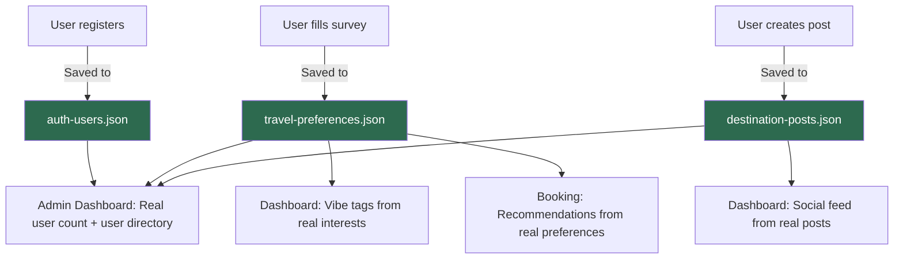

# Connect SugboGo System — Replace Static Data with Real Data Flow

## Problem

The SugboGo system currently has all its major pages (Dashboard, Admin Dashboard, Explore) using **hardcoded static/seed data** rather than real data from the database. Specifically:

| Component | Current State | What's Wrong |
|---|---|---|
| **Dashboard social feed** | Hardcoded 4 fake posts in `DashboardExperienceService` | Posts don't come from DB, user can't create real ones |
| **Dashboard saved gems** | Hardcoded 3 items | Not tied to user actions |
| **Dashboard vibe tags** | Hardcoded, seeded from email hash | Not based on user's actual travel preferences |
| **Admin KPIs** | Hardcoded numbers (18, 11, 842K, 37) | Not derived from real user/booking counts |
| **Admin user directory** | Hardcoded 3 fake "flashpacker" profiles | Doesn't show actual registered users |
| **Admin vibe trends** | Hardcoded percentages | Not based on real preference data |
| **Admin pipeline** | Hardcoded kanban cards | Not connected to any booking state |
| **Post creation form** | Form exists in Dashboard view but doesn't submit | No controller action or data store |

**What works already:** Auth (register/login with Local JSON), travel preference survey (persisted to JSON), and recommendation engine (reads real preferences).

---

## Proposed Changes

### 1. New Data Model — `DestinationPost`

#### [NEW] [Models/DestinationPost.cs](file:///c:/Users/alarb/MVC%20Project/SugboGo/Models/DestinationPost.cs)

A new model to represent user-submitted destination posts (the social feed). Fields:
- `Id`, `UserId`, `AuthorName`, `AuthorEmail`
- `DestinationName`, `Location`, `Description`, `Caption`
- `Tag` (category), `ImageFileName` (local file reference)
- `Likes`, `Comments`, `CreatedAt`

---

### 2. New Data Store — `IDestinationPostStore` + `LocalJsonDestinationPostStore`

#### [NEW] [Services/Dashboard/IDestinationPostStore.cs](file:///c:/Users/alarb/MVC%20Project/SugboGo/Services/Dashboard/IDestinationPostStore.cs)

Interface with:
- `GetAllAsync()` — returns all posts ordered by newest
- `GetByUserIdAsync(userId)` — user's own posts
- `CreateAsync(post)` — persist a new post
- `IncrementLikesAsync(postId)` — +1 like

#### [NEW] [Services/Dashboard/LocalJsonDestinationPostStore.cs](file:///c:/Users/alarb/MVC%20Project/SugboGo/Services/Dashboard/LocalJsonDestinationPostStore.cs)

JSON file-based implementation following the exact same pattern as `LocalJsonUserAccountStore` and `LocalJsonTravelPreferenceStore`. Persists to `App_Data/destination-posts.json`.

---

### 3. Rewire Dashboard — Real Posts, Real Preferences, Real Saved Gems

#### [MODIFY] [DashboardExperienceService.cs](file:///c:/Users/alarb/MVC%20Project/SugboGo/Services/Dashboard/DashboardExperienceService.cs)

**Major changes:**
- Inject `IDestinationPostStore` and `ITravelPreferenceStore`
- Change `BuildForUser` to `async` so it can read from stores
- `SocialFeed` → built from real posts in the JSON store
- `VibeTags` → built from the user's actual travel preference record (their selected interests)
- `SavedGems` → initially empty until user has real saved items (keep as feature placeholder with a message)
- Keep `CuratedGems` static for now (these are editorial/AI-curated, not user-generated)
- Keep `ActiveTrip` + `Bookings` as seed data (no booking persistence yet beyond preferences)

#### [MODIFY] [IDashboardExperienceService.cs](file:///c:/Users/alarb/MVC%20Project/SugboGo/Services/Dashboard/IDashboardExperienceService.cs)

Change return type to `Task<DashboardViewModel>` (async).

#### [MODIFY] [DashboardController.cs](file:///c:/Users/alarb/MVC%20Project/SugboGo/Controllers/DashboardController.cs)

- Make `Index` async
- Add `[HttpPost] CreatePost` action to handle the social feed form submission
- Add `[HttpPost] LikePost` API action for the like button

---

### 4. Rewire Admin Dashboard — Real Users, Real Preferences, Real Counts

#### [MODIFY] [AdminOperationsService.cs](file:///c:/Users/alarb/MVC%20Project/SugboGo/Services/Admin/AdminOperationsService.cs)

**Major changes:**
- Inject `IUserAccountStore`, `ITravelPreferenceStore`, `IDestinationPostStore`
- Change `BuildDashboard` to `async`
- **KPIs**: Calculate from real data:
  - "Total Users" → count from user store
  - "Total Posts" → count from post store
  - "Preferences Submitted" → count from preference store  
  - "Latest Signup" → most recent user's date
- **Flashpackers/User Directory** → show real registered users with their preference data
- **Vibe Trends** → aggregate actual interest selections from all preference records
- Keep Partners, Gems, Templates, Pipeline, Collaboration as editorial data (these are admin-managed, not user-generated)

#### [MODIFY] [IAdminOperationsService.cs](file:///c:/Users/alarb/MVC%20Project/SugboGo/Services/Admin/IAdminOperationsService.cs)

Change to `Task<AdminDashboardViewModel>`.

#### [MODIFY] [AdminController.cs](file:///c:/Users/alarb/MVC%20Project/SugboGo/Controllers/AdminController.cs)

Make `Index` async.

---

### 5. Extend User Account Store — Add `GetAllAsync`

#### [MODIFY] [IUserAccountStore.cs](file:///c:/Users/alarb/MVC%20Project/SugboGo/Services/Auth/IUserAccountStore.cs)

Add: `Task<List<UserAccount>> GetAllAsync(CancellationToken)`

#### [MODIFY] [LocalJsonUserAccountStore.cs](file:///c:/Users/alarb/MVC%20Project/SugboGo/Services/Auth/LocalJsonUserAccountStore.cs)

Implement `GetAllAsync` — reads and returns all users from JSON file.

#### [MODIFY] [PostgresUserAccountStore.cs](file:///c:/Users/alarb/MVC%20Project/SugboGo/Services/Auth/PostgresUserAccountStore.cs)
#### [MODIFY] [SupabaseUserAccountStore.cs](file:///c:/Users/alarb/MVC%20Project/SugboGo/Services/Auth/SupabaseUserAccountStore.cs)

Add `GetAllAsync` stub implementations (throw `NotImplementedException` for now since Postgres/Supabase aren't configured).

---

### 6. Extend Travel Preference Store — Add `GetAllAsync`

#### [MODIFY] [ITravelPreferenceStore.cs](file:///c:/Users/alarb/MVC%20Project/SugboGo/Services/Travel/ITravelPreferenceStore.cs)

Add: `Task<List<TravelPreferenceRecord>> GetAllAsync(CancellationToken)`

#### [MODIFY] [LocalJsonTravelPreferenceStore.cs](file:///c:/Users/alarb/MVC%20Project/SugboGo/Services/Travel/LocalJsonTravelPreferenceStore.cs)

Implement `GetAllAsync`.

#### [MODIFY] [PostgresTravelPreferenceStore.cs](file:///c:/Users/alarb/MVC%20Project/SugboGo/Services/Travel/PostgresTravelPreferenceStore.cs)
#### [MODIFY] [SupabaseTravelPreferenceStore.cs](file:///c:/Users/alarb/MVC%20Project/SugboGo/Services/Travel/SupabaseTravelPreferenceStore.cs)

Add `GetAllAsync` stub implementations.

---

### 7. Register New Services

#### [MODIFY] [Program.cs](file:///c:/Users/alarb/MVC%20Project/SugboGo/Program.cs)

Register `IDestinationPostStore` → `LocalJsonDestinationPostStore`.

---

### 8. Update Dashboard View — Wire the Post Form

#### [MODIFY] [Views/Dashboard/Index.cshtml](file:///c:/Users/alarb/MVC%20Project/SugboGo/Views/Dashboard/Index.cshtml)

- Change the `<form>` to submit to `Dashboard/CreatePost` with proper `asp-*` attributes and anti-forgery token
- Keep the existing UI structure; just wire it to actually POST

---

## Data Flow After Changes

## What Stays Static (Intentionally)

These remain editorial/curated content that admins would manage manually:
- **Explore page** tours, trails, gastronomy cards (marketing content)
- **Admin Gems table** (admin-managed hidden gem database)
- **Admin Partners** (admin-managed vendor data)
- **Admin Pipeline** (would need a full booking state machine — out of scope)
- **Admin Templates** (curated itinerary templates)
- **Dashboard CuratedGems** (AI/editorial picks)
- **Dashboard ActiveTrip** (would need real booking integration)

> [!IMPORTANT]
> These editorial sections staying static is correct — they represent content that would be managed through an admin CMS in production. The key change is that **user-generated data** (registrations, preferences, posts) now flows through the entire system.

---

## Verification Plan

### Automated Tests
1. `dotnet build` — ensure no compile errors
2. Run the app with `dotnet run` and test the full flow:

### Manual Verification (Browser)
1. Register a new account → verify it appears in Admin user directory
2. Fill out travel preference survey → verify Dashboard vibe tags update to match
3. Create a destination post from Dashboard → verify it appears in the social feed
4. Check Admin Dashboard → verify KPIs show real counts (1 user, 1 post, etc.)
5. Register a second account → verify Admin KPIs update
6. Fill different preferences on second account → verify Admin vibe trends update
